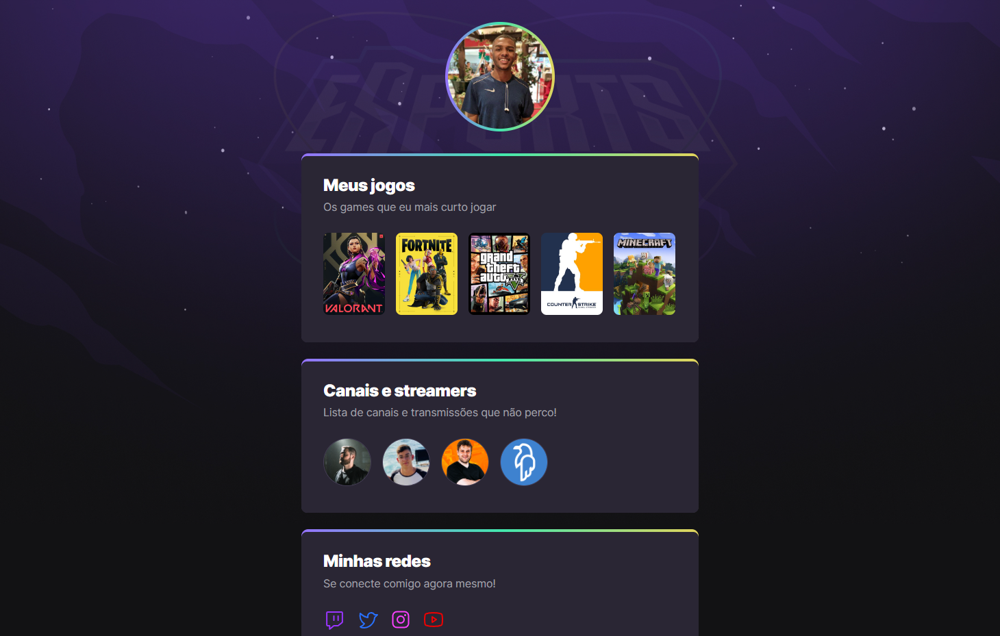

# 🌍 NLW eSports

> Trilha Explorer
Projeto construído do evento Next Level Week da Rocketseat.

[🔗 Clique aqui para acessar](https://matheuskaully.github.io/nlw-esports-explorer/)

Projeto prático com HMTL e CSS, onde o mesmo mostra meu perfil gamer com os jogos e canais que sigo.

## 🛠 Tecnologias:

- HTML
- CSS
- Git e Github

## 💛 Contatos:

🌍 E-mail: matheuskaully@gmail.com

    
